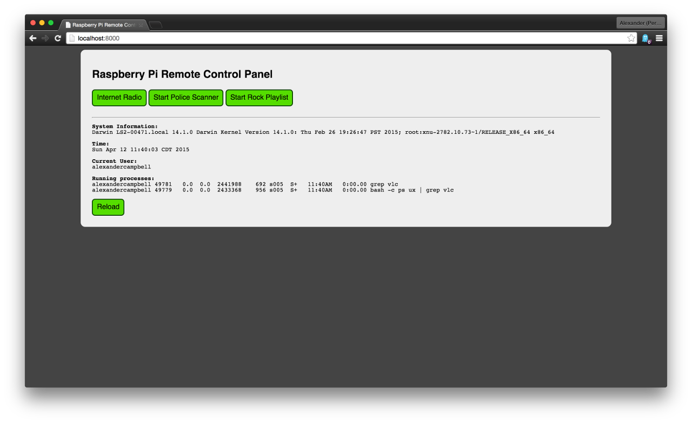

## Music-Controller

Music-Controller is a simple way to control your Raspberry Pi from a remote
browser.

This program requires [Go 1.0](http://golang.org/) or greater. To start using
Music-Controller, add some bash scripts to the `scripts/` directory. Then, do

	go build
	./music-controller

A webserver will be launched on port :8000, serving your scripts as Javascript
buttons.

*Note*: This was created as a quick hack, so it probably has some bugs.

